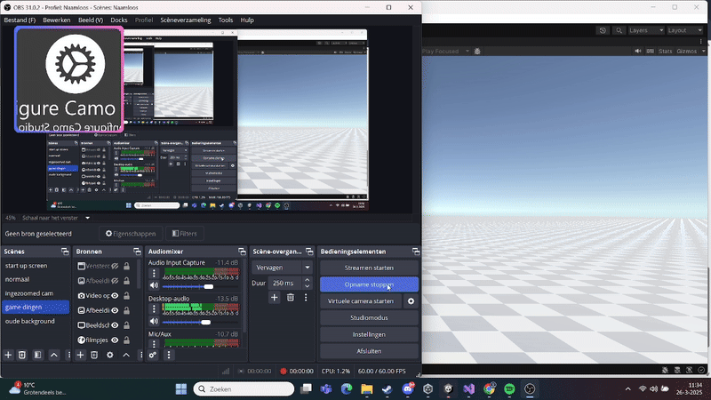
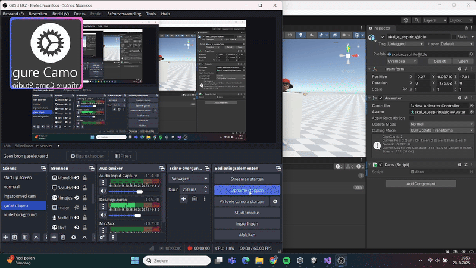
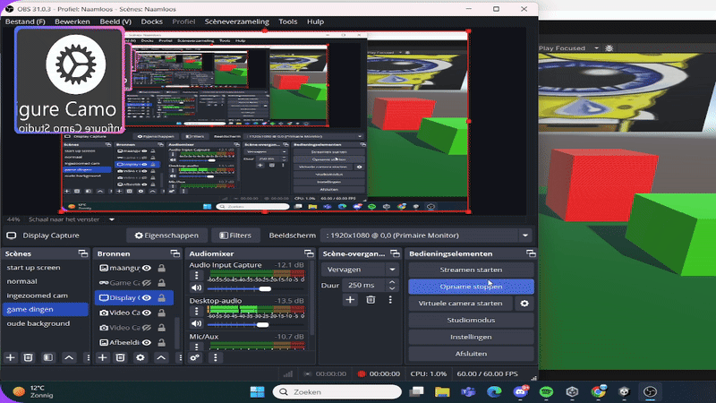
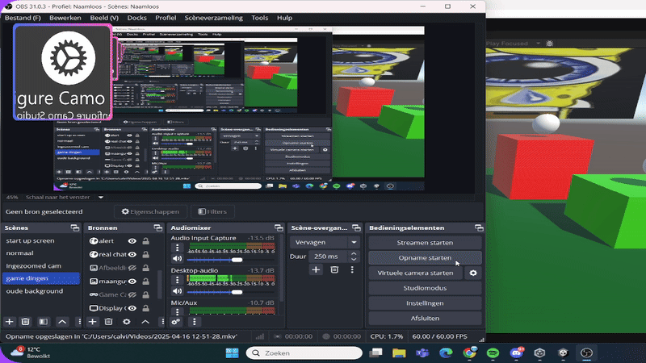

# GD---PROG---Tutorial-0

dit is de uitwerking van tutorial 0 waarin ik een blokje lanceer

Het bijbehorende script staat hier [link naar Launch Cube script](/GD%20-%20PROG%20-%20Tutorial/Assets/LaunchCube.cs)

Movement [het script](/GD%20-%20PROG%20-%20Tutorial/Assets/movement.cs)

# Tutorial 1

dit is de uitwerking van de dance

[het script](/GD%20-%20PROG%20-%20Tutorial/Assets/dans.cs)

# Tutorial 2 

uitwerking van animation met movement echt sickkkkk

.gif)

[het script](/GD%20-%20PROG%20-%20Tutorial/Assets/animatie.cs)

Movement [het script](/GD%20-%20PROG%20-%20Tutorial/Assets/movement.cs)

# Tutorial 3

dit is het werk van de cuve ding

[het script](/GD%20-%20PROG%20-%20Tutorial/Assets/Jump.cs)

# Tutorial 4 

[het script](/GD%20-%20PROG%20-%20Tutorial/Assets/PICKUP.cs)
[het script](/GD%20-%20PROG%20-%20Tutorial/Assets/keepscore.cs)

